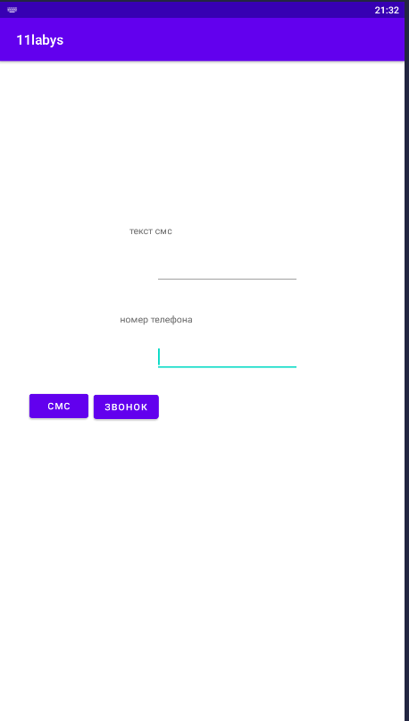

# Гончаров Кирилл 803в1 
Проверить не могу потому что нету андройд смартфона нету, а в блустаксе не работает так как нету связи(Вроде работает попросил смской друга проверить)

</img>

</img>

Когда я нажимаю отправить смс оно открывает сообщения в системе с текстом, который ввели в приложение
